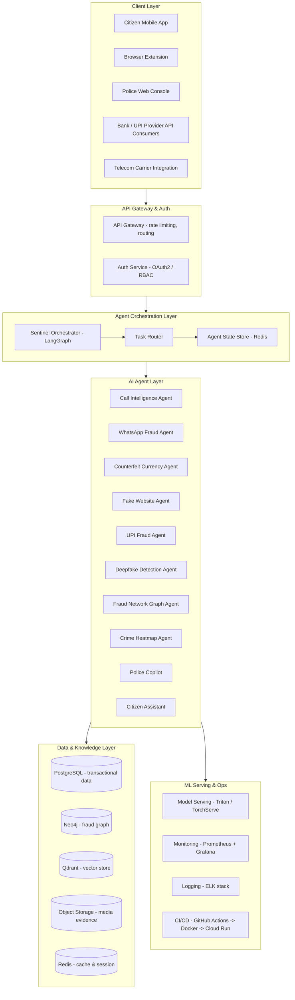
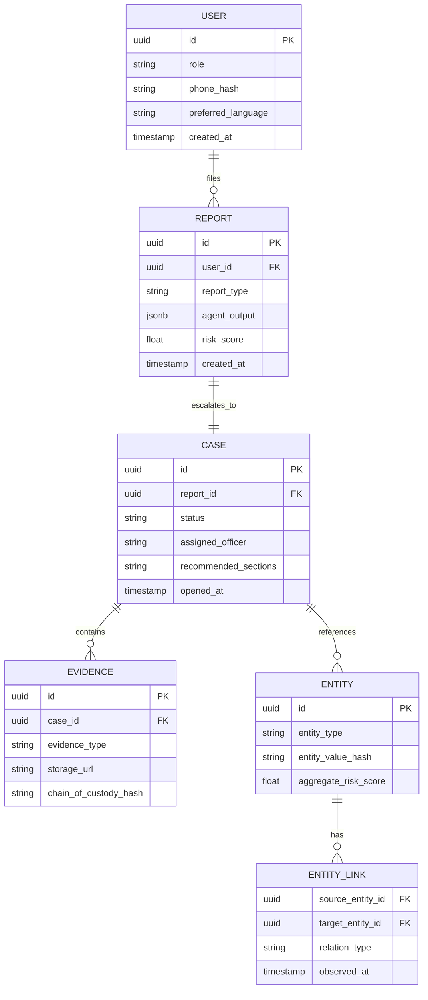

# Sentinel AI
### An AI Digital Crime Prevention Operating System
**ET AI Hackathon 2026 — Problem Statement 6: AI for Digital Public Safety (Counterfeiting, Fraud & Digital Arrest Scams)**

---

## 1. Executive Summary

Digital arrest scams, UPI fraud, deepfake extortion, and counterfeit currency are no longer isolated incidents in India — they are a networked criminal economy. Most existing tools respond to one symptom at a time: an OTP fraud detector here, a phishing-URL checker there, a currency-scanning app somewhere else. None of them talk to each other, and none of them help law enforcement see the network behind the crime.

**Sentinel AI** is a Digital Crime Prevention Operating System, not a single model or a single app. It is a coordinated fleet of ten specialized AI agents — covering calls, messages, currency, websites, payments, media, and criminal networks — that share a common risk graph and a common orchestrator. A citizen who gets a scam call, a bank flagging a suspicious UPI transfer, and a police officer building a case file are all touching the same underlying intelligence layer, just through different front doors.

The platform is designed to be deployable by the actors who actually own this problem today — banks, telecom operators, UPI providers, State Police Cyber Cells, CERT-In, and citizens directly — rather than existing as a standalone demo.

---

## 2. Problem Understanding

Problem Statement 6 asks for AI that prevents digital crime across three connected fronts:

1. **Digital arrest and impersonation scams** — fraudsters posing as police, CBI, customs, or judiciary officials over video/voice calls to extort victims through fear.
2. **Counterfeiting** — primarily counterfeit currency, but structurally identical to counterfeit documents, fake government notices, and fake e-commerce/KYC portals.
3. **Financial fraud** — UPI fraud, phishing, investment and loan scams, and the fraud networks (mule accounts, shell numbers, disposable UPI IDs) that make all of the above scalable.

The common thread across all three is that **the crime is never really a single event** — it is a chain (a call, a link, a fake app, a payment, a mule account) that only becomes visible when you connect the dots across channels. That reframing is the core design insight behind Sentinel AI: build shared infrastructure for cross-channel correlation, not ten disconnected point solutions.

### 2.1 Official Requirement → Sentinel AI Alignment

| Official Problem Requirement | Sentinel AI Feature | Primary AI Discipline |
|---|---|---|
| Digital Arrest Scam Detection | Call Intelligence Agent | Speech AI, NLP |
| Counterfeit Currency Detection | Counterfeit Currency Agent | Computer Vision |
| Financial Fraud Detection | UPI Fraud Agent, WhatsApp Fraud Agent | NLP, Tabular ML |
| Fraud Network Intelligence | Fraud Network Graph Agent | Graph AI |
| Citizen Protection | Citizen Assistant, Family Safety Dashboard | NLP, Agentic AI |
| Law Enforcement Assistance | Police Copilot | RAG, LLMs |
| Geospatial Crime Intelligence | Crime Heatmap Agent | Geospatial ML |
| Agentic AI | Sentinel Orchestrator (LangGraph) | Multi-agent systems |
| Computer Vision | Counterfeit Agent, Deepfake Agent | CV |
| NLP / LLMs | WhatsApp Agent, Police Copilot, Citizen Assistant | NLP, LLMs |
| Graph AI | Fraud Network Graph Agent (Neo4j) | Graph AI |
| Speech AI | Call Intelligence Agent | ASR, Speaker/Spoof Detection |
| Explainable AI | Evidence Layer across all agents | XAI |

Every agent below maps to at least one row in this table — nothing in the platform exists outside the official scope.

---

## 3. Solution Overview

Sentinel AI has three layers:

1. **Sensing layer (10 agents)** — each agent is a domain specialist that ingests one type of signal (a call, a message, an image of currency, a URL, a payment request, a video) and outputs a structured, explainable risk assessment.
2. **Correlation layer (Fraud Network Graph + Orchestrator)** — every risk signal, regardless of which agent produced it, is written into a shared graph. This is what lets the system notice that a phone number flagged by the Call Agent yesterday is the same number linked to a UPI ID flagged by the UPI Agent today.
3. **Action layer (Citizen Assistant, Police Copilot, Dashboards)** — the same intelligence is surfaced differently depending on who is asking: a citizen gets a plain-language warning, a bank gets a real-time stop/proceed signal, and an investigator gets a case file with legal citations.

The system is designed to **prevent before it explains** — every agent runs pre-transaction or pre-harm wherever technically possible (before a payment clears, before a call victim is asked to move to a "safe location," before a fake notice is acted on), and explains its reasoning after the fact for both the citizen and the investigator.

---

## 4. Unique Selling Proposition

Most hackathon teams will build one strong point solution — a deepfake detector, or a phishing classifier, or a currency scanner. Sentinel AI's USP is not any single model; it is three structural choices most teams won't make:

1. **Shared Fraud Graph as the spine, not an afterthought.** Every agent writes to and reads from one graph. A scam is rarely caught by one signal; it's caught by triangulation. This is the single biggest differentiator versus siloed detectors and directly satisfies the "Fraud Network Intelligence" and "Graph AI" objectives at the architecture level, not just as one bolt-on feature.
2. **One explainability contract for every agent.** Every prediction — currency, call, deepfake, URL, payment — returns the same structured object: confidence, evidence, reasoning, and (where relevant) the graph path and legal citation that support it. This makes the system audit-ready for law enforcement and regulator use from day one, not retrofitted later.
3. **Same intelligence, different lens.** A citizen, a bank compliance officer, and a police investigator are served by the same backend, not three separate products. This is what makes the platform pitchable to Ministry of Home Affairs / CERT-In / banks / citizens simultaneously, which is exactly the deployment story judges will be scoring on Business Impact and Scalability.

---

## 5. System Architecture



### 5.1 Why each layer exists

| Layer | Purpose | Why it's necessary |
|---|---|---|
| API Gateway | Single entry point, rate limiting, request routing | Banks/telecom will integrate via API; needs contract stability and abuse protection |
| Auth (RBAC) | Citizen / Bank / Police / Admin roles | A citizen must never see another citizen's case; police access needs audit trails for court admissibility |
| Orchestrator (LangGraph) | Coordinates which agents run, in what order, with shared state | A WhatsApp message with a QR code needs OCR → URL Agent → Graph Agent in sequence — this is a workflow, not a single model call |
| Agent layer | Domain-specialized models, independently scalable | Deepfake detection and currency CV have very different compute profiles; independent scaling avoids over-provisioning |
| Neo4j (Graph DB) | Native graph traversal for fraud rings | Relational joins across 7+ entity types (phone, UPI ID, device, IP, bank account) at investigation scale become prohibitively slow in SQL |
| Qdrant (Vector DB) | Semantic search over scam scripts, legal text, and case history | RAG for Police Copilot and semantic matching of new scam messages against known scam script clusters |
| PostgreSQL | Transactional and structured records | Case management, user accounts, audit logs need ACID guarantees |
| Object Storage | Call recordings, images, video evidence | Chain-of-custody requirement for anything used as legal evidence |
| Redis | Session state, agent handoff state, hot cache | Multi-agent workflows need shared, low-latency state between hops |

---

## 6. Tech Stack

| Category | Choice | Rationale |
|---|---|---|
| Frontend | React + Next.js | SSR for public-facing pages (SEO for awareness content), fast dashboards for police/bank consoles |
| Backend | FastAPI (Python) | Async-first, native fit with the Python ML/agent ecosystem, auto-generated OpenAPI docs |
| Agent Orchestration | LangGraph | Explicit state graphs suit multi-step, conditional workflows (e.g., "if QR detected, route to URL Agent") better than purely conversational frameworks |
| Multi-agent collaboration | CrewAI (for Police Copilot's internal sub-tasks: summarizer, section-recommender, report-drafter) | Role-based crews are a natural fit for a single complex document-generation task with sub-specialists |
| LLM Orchestration alt. | AutoGen (evaluated, not primary) | Considered for agent-to-agent negotiation patterns; LangGraph chosen as primary for deterministic auditability, which matters more here than open-ended agent chat |
| Computer Vision | YOLOv8 (region detection), OpenCV (preprocessing), InsightFace (face embedding/verification for deepfake pipeline) | Mature, well-benchmarked, real-time capable on modest GPUs |
| Speech AI | Whisper (ASR), SpeechBrain (speaker verification, anti-spoofing) | Whisper is the strongest open ASR for Indian-accented English/Hindi; SpeechBrain has ready anti-spoofing recipes (ASVspoof-trained) |
| NLP (Indian languages) | XLM-RoBERTa, MuRIL, mBERT | MuRIL is purpose-built for Indian languages/code-mixing (Hinglish), critical for scam messages that mix English and regional languages |
| Embeddings | BGE-large, Jina Embeddings v2 | Strong open retrieval benchmarks, multilingual variants available |
| Vector DB | Qdrant | Open-source, filterable payloads (needed to scope RAG search by jurisdiction/law type), self-hostable for data sovereignty |
| Graph DB | Neo4j + Graph Data Science library | Native support for PageRank, community detection (Louvain), and shortest-path — exactly the algorithms fraud-ring detection needs |
| Relational DB | PostgreSQL | ACID compliance for case records, mature RBAC extensions (Row-Level Security) |
| Cache/Session | Redis | Sub-millisecond agent handoff state |
| Maps | Mapbox (production), Leaflet (open-source fallback) | Mapbox for polished heatmap rendering; Leaflet keeps a fully open-source deployment path for government procurement |
| Deployment | Docker, Kubernetes-ready, Cloud Run (demo), Azure/AWS (production, per client — banks and MHA often mandate specific cloud empanelment) | Container-first keeps the same artifact deployable across a hackathon demo and a government data-center |

---

## 7. Multi-Agent Architecture

### 7.1 The Ten Agents

**1. Call Intelligence Agent** — Real-time digital arrest / impersonation scam detection.
- Pipeline: live audio → Whisper ASR → scam-script similarity match (embedding search against known digital-arrest script corpus) → SpeechBrain anti-spoofing/AI-voice check → MuRIL-based intent classifier ("urgency + authority impersonation + payment demand" pattern) → caller risk score.
- Output: risk score 0–100, flagged phrases, "why suspicious" explanation (e.g., "caller claimed to be CBI and demanded payment via unrecorded channel — no Indian law enforcement agency conducts arrests over video call").

**2. WhatsApp Fraud Intelligence Agent** — Multimodal message triage.
- Pipeline: text → MuRIL/XLM-R classifier; images/PDFs → OCR (Tesseract/PaddleOCR) → text classifier; QR codes → decode → hand off to Fake Website Agent; voice notes → Whisper → text pipeline.
- Detects: phishing, fake KYC, fake government/police notices, investment/job/loan/parcel scams.
- Output: fraud probability + category + highlighted phrases + matched known-scam-template similarity score.

**3. Counterfeit Currency Intelligence Agent** — Computer vision on currency images.
- Pipeline: image → alignment/crop → YOLOv8 region proposals on security features (watermark, security thread, micro-print, latent image, serial number) → per-region CNN classifiers → aggregated genuineness score.
- Output: genuine/counterfeit probability, bounding-box overlay on suspicious regions, per-feature breakdown ("security thread: pass, micro-print: fail").

**4. Fake Website Intelligence Agent** — URL/domain risk assessment.
- Pipeline: URL → WHOIS lookup, SSL certificate inspection, domain-age check, Levenshtein/visual-similarity comparison against a curated list of official domains (banks, gov portals), lightweight headless-browser render → visual phishing-kit similarity (perceptual hashing), JS behavior static analysis for credential-harvesting patterns.
- Output: Safe / Suspicious / Dangerous + reasoning ("registered 4 days ago, visually 94% similar to onlinesbi.com, no valid SSL").

**5. UPI Fraud Intelligence Agent** — Pre-transaction risk scoring.
- Pipeline: receiver UPI ID/account → cross-reference Fraud Network Graph for prior flags → transaction context features (amount vs. history, time-of-day anomaly, first-time payee + high amount, receiver account age) → gradient-boosted risk model (XGBoost/LightGBM, trained on patterns from IEEE-CIS / PaySim-style synthetic fraud data, calibrated with rule-based India-specific heuristics).
- Output: Proceed / Stop Payment / Proceed with Caution, with the specific contributing factors listed (SHAP-based explanation).

**6. Deepfake Detection Agent** — Synthetic media forensics.
- Pipeline: image/video → face detection (MTCNN) → EfficientNet-B4 classifier with a DCT (frequency-domain) branch for GAN artifact detection → temporal consistency check across frames (lip-sync vs. audio) for video; audio → SpeechBrain voice-clone detector.
- Output: manipulated probability, highlighted regions/frames, modality-specific flags (face swap vs. voice clone vs. lip-sync mismatch).

**7. Fraud Network Intelligence Agent** — The correlation spine.
- Graph schema: nodes = {PhoneNumber, BankAccount, UPIID, Website, Device, Victim, IPAddress, Email}; edges = {CALLED, TRANSFERRED_TO, REGISTERED_ON_DEVICE, ACCESSED_FROM_IP, REPORTED_BY}.
- Algorithms: community detection (Louvain) to surface scam rings, PageRank-style centrality to identify likely "masterminds" (high-centrality nodes connected to many flagged entities), shortest-path queries to explain *why* two entities are linked.
- Output: interactive graph visualization + investigation-ready subgraph export + ranked list of high-centrality entities.

**8. Crime Heatmap Agent** — Geospatial intelligence.
- Ingests geotagged incident reports (with consent/anonymization) across scam types, aggregates district/time-wise, and runs a simple spatio-temporal forecasting model (e.g., Prophet or a spatial ARIMA variant) to flag likely emerging hotspots for proactive patrol/awareness deployment.

**9. Police Copilot** — Investigator-facing RAG assistant (CrewAI crew: Summarizer, Legal-Section-Recommender, Report-Drafter, Case-Searcher).
- RAG corpus: CERT-In advisories, RBI fraud circulars, NCRB data, BNS (Bharatiya Nyaya Sanhita) and IT Act sections, official scam-awareness material.
- Capabilities: case summarization, FIR draft generation, BNS/IT Act section recommendation with citation, similar-case search, investigation-step suggestions — every output cites the source document/section.

**10. Citizen Assistant** — Multilingual front door (English, Hindi, Bengali; architecture supports adding languages via swapping the MuRIL/IndicTrans fine-tune).
- Capabilities: "is this call/message/site real?" triage, fraud reporting intake, nearest cyber cell lookup, plain-language safety guidance, hands off to the appropriate specialist agent behind the scenes.

### 7.2 Orchestrator Design

The **Sentinel Orchestrator** is a LangGraph state machine, not a chatbot loop. Each incoming request creates a shared state object; the orchestrator's router node inspects the input type and content and conditionally routes to one or more agents, merging outputs before responding. This keeps the system auditable — every routing decision and every intermediate agent output is logged and replayable, which matters both for debugging and for evidentiary integrity if a case goes to court.

---

## 8. Multi-Agent Workflows

**Workflow 1 — Suspicious WhatsApp forward**
Citizen uploads message → OCR (if image) → WhatsApp Fraud Agent → if URL present, hand off to Fake Website Agent → if QR present, decode and hand off to Fake Website Agent → results merged → written to Fraud Graph → Citizen Assistant returns plain-language verdict → citizen can one-tap "report," which opens a case for Police Copilot.

**Workflow 2 — Live digital arrest call**
Citizen enables Call Shield → live audio streamed to Call Intelligence Agent → real-time risk score updates every few seconds → if risk crosses threshold, Citizen Assistant pushes an on-screen warning overlay mid-call → if citizen reports post-call, transcript + risk trace is written to Fraud Graph and offered to Police Copilot for case creation.

**Workflow 3 — Pre-payment UPI check**
Bank/UPI app calls Sentinel API before confirming a transfer → UPI Fraud Agent queries Fraud Graph for receiver history → risk score returned in under 300ms → app displays Proceed/Caution/Stop to user → outcome (did user proceed anyway) logged back to Graph to improve future scoring.

**Workflow 4 — Currency verification at a merchant counter**
Merchant/citizen scans note via app → Counterfeit Currency Agent → result with highlighted regions → if counterfeit, prompts one-tap report → geotagged (with consent) → feeds Crime Heatmap Agent.

**Workflow 5 — Deepfake video sent for "video KYC" or extortion**
Citizen/bank uploads clip → Deepfake Detection Agent → if manipulated, cross-checked against Fraud Graph for known campaign signatures → Police Copilot pre-drafts a case note automatically.

**Workflow 6 — Fraud ring investigation**
Investigator queries Police Copilot ("show me everything connected to this UPI ID") → Fraud Network Graph Agent returns subgraph + centrality ranking → Police Copilot summarizes findings and recommends BNS/IT Act sections → investigator exports investigation-ready report.

**Workflow 7 — New scam pattern early warning**
Multiple citizens report structurally similar WhatsApp messages within a short time window in the same district → WhatsApp Agent's embedding clusters flag a new template → Crime Heatmap Agent geotags the cluster → Citizen Assistant proactively pushes an area-specific awareness alert before volume scales.

**Workflow 8 — Senior Citizen Protection Mode**
A family member enrolls a senior citizen's number → any incoming call/message flagged above a (lower, more conservative) risk threshold triggers a real-time notification to the registered family contact in addition to the senior citizen, alongside a simplified, large-text warning UI.

**Workflow 9 — Bank-side mule account detection**
Bank runs a batch job through the Fraud Network Graph Agent → accounts with graph patterns typical of mule behavior (many small inbound transfers from newly-flagged UPI IDs, rapid outbound sweep) are ranked and flagged for compliance review — an entirely proactive, pre-complaint workflow.

**Workflow 10 — Cross-platform correlation**
A phone number flagged by the Call Intelligence Agent today is later used to register a UPI ID flagged by the UPI Fraud Agent next week → because both write to the same Fraud Graph, the second event automatically inherits elevated risk and the Police Copilot can show the full timeline connecting both incidents to the same case.

---

## 9. Database Design

### 9.1 Entity-Relationship Diagram (core schema)



Notes:
- `ENTITY` and `ENTITY_LINK` mirror the graph schema for fast relational lookups and are kept in sync with Neo4j via an event stream (rather than storing the whole graph twice — Neo4j is source of truth for traversal queries, Postgres holds the transactional/audit view).
- Sensitive identifiers (`phone_hash`, `entity_value_hash`) are stored hashed, not raw, with a separate access-controlled vault mapping hashes to raw values — only available to authenticated law-enforcement roles with case-linked justification, logged for audit.

### 9.2 Indexing strategy
- `REPORT(risk_score, created_at)` composite index for real-time dashboards.
- `ENTITY(entity_type, entity_value_hash)` unique index for fast dedup on ingestion.
- Neo4j: native indexes on all node `entity_value_hash` properties; relationship property index on `observed_at` for time-windowed traversal queries (used heavily by Workflow 7's early-warning clustering).

---

## 10. API Design

Base URL: `/api/v1`. Auth: OAuth2 bearer tokens; roles = `citizen`, `bank_partner`, `police`, `admin` (Postgres Row-Level Security enforces role-scoped reads).

| Endpoint | Method | Role | Purpose |
|---|---|---|---|
| `/auth/login` | POST | all | Issue role-scoped token |
| `/agents/call/analyze` | POST | citizen, bank_partner | Submit audio stream/clip for Call Intelligence Agent |
| `/agents/whatsapp/analyze` | POST | citizen | Submit message/image/QR for WhatsApp Fraud Agent |
| `/agents/currency/scan` | POST | citizen, bank_partner | Submit currency image |
| `/agents/website/check` | POST | citizen, bank_partner | Submit URL for risk check |
| `/agents/upi/precheck` | POST | bank_partner | Pre-transaction risk score (used inline before payment confirmation) |
| `/agents/deepfake/analyze` | POST | citizen, police | Submit image/video/audio |
| `/graph/entity/{id}` | GET | police, admin | Fetch entity + connected subgraph |
| `/graph/query` | POST | police, admin | Custom Cypher-backed investigation query (sandboxed) |
| `/heatmap/incidents` | GET | citizen, police | Aggregated, anonymized incident geodata |
| `/copilot/case/{id}/summary` | GET | police | Auto-generated case summary with legal citations |
| `/copilot/fir/draft` | POST | police | Generate FIR draft from case data |
| `/reports` | POST | citizen | File a new report, creates a `REPORT` record |
| `/reports/{id}` | GET | citizen (own), police | Track report status |

**Example — UPI pre-check request/response:**
```json
POST /agents/upi/precheck
{
  "receiver_upi_id": "example@upi",
  "amount": 25000,
  "sender_context": { "payee_is_new": true, "time_of_day": "23:40" }
}

Response:
{
  "risk_score": 78,
  "recommendation": "STOP_PAYMENT",
  "reasoning": [
    "Receiver UPI ID linked to 3 prior fraud reports in Fraud Graph",
    "First-time payee with high amount at unusual hour",
    "Receiver account created within last 10 days"
  ],
  "graph_path_id": "gpath_9182"
}
```

All endpoints return a consistent `explanation` object (see Section 12) alongside the domain-specific payload.

---

## 11. AI Model Selection Summary

| Agent | Primary Model(s) | Why this model |
|---|---|---|
| Call Intelligence | Whisper (ASR) + SpeechBrain (anti-spoof) + MuRIL (intent) | Best open coverage for Indian-language, code-mixed speech at real-time latency |
| WhatsApp Fraud | MuRIL / XLM-RoBERTa fine-tuned classifier + BGE embeddings for template matching | Handles Hindi/Bengali/English/code-mixed text in one pipeline |
| Counterfeit Currency | YOLOv8 (region detection) + custom CNN heads per security feature | Region-level explainability is a judging-relevant requirement, not just a binary label |
| Fake Website | Rule-based WHOIS/SSL checks + perceptual-hash visual similarity + lightweight XGBoost meta-classifier | Combines deterministic signals (SSL, domain age) with fuzzy visual similarity for balanced precision |
| UPI Fraud | XGBoost/LightGBM + SHAP explainability | Tabular gradient boosting remains state-of-the-art for structured transaction fraud at low latency |
| Deepfake Detection | EfficientNet-B4 + DCT frequency branch, MTCNN face detection | Frequency-domain branch catches GAN upsampling artifacts that pure spatial CNNs miss |
| Fraud Network Graph | Neo4j Graph Data Science (Louvain, PageRank) | Purpose-built graph algorithms outperform ad hoc SQL recursive queries at scale |
| Crime Heatmap | Prophet / spatial time-series model | Lightweight, interpretable, sufficient for district-level forecasting granularity |
| Police Copilot | RAG over Qdrant + instruction-tuned LLM, CrewAI role-based sub-agents | Legal-citation accuracy requires retrieval grounding, not free generation |
| Citizen Assistant | Same LLM backbone, lightweight persona layer, IndicTrans for language routing | Reuses Police Copilot's LLM infrastructure; keeps operational cost down |

---

## 12. Dataset Recommendations

| Use Case | Dataset | How it maps |
|---|---|---|
| Voice spoof / AI-voice detection | ASVspoof 2019/2021 | Training and benchmarking the Call Agent's anti-spoofing branch |
| Speaker verification | VoxCeleb | Pretraining speaker-embedding backbone for spoof detection |
| Scam/spam message classification | UCI SMS Spam Collection, Kaggle Fraudulent Email Corpus | Base classifier pretraining before fine-tuning on India-specific scam templates |
| Phishing URLs | PhishTank, OpenPhish, UCI Phishing Websites Dataset | Training/benchmarking the Fake Website Agent |
| Counterfeit currency | UCI Banknote Authentication dataset (feature-based), Kaggle Indian currency image datasets | Baseline feature classifier + CV region detector fine-tuning |
| Deepfake images/video | FaceForensics++, Celeb-DF, DFDC (Deepfake Detection Challenge) | Training/benchmarking the Deepfake Agent across manipulation types |
| Transaction fraud | IEEE-CIS Fraud Detection (Kaggle), PaySim synthetic mobile-money dataset, Credit Card Fraud (ULB/Kaggle) | Training the UPI Fraud Agent's tabular model; PaySim is especially close to UPI-style mobile transaction patterns |
| Graph-based fraud/AML | Elliptic Bitcoin dataset | Benchmarking graph algorithms (community detection, centrality) before applying to the live Fraud Graph |
| Legal/regulatory corpus (RAG) | CERT-In advisories, RBI fraud circulars, NCRB reports, BNS/IT Act text (public government sources) | Ingested into the RAG pipeline for Police Copilot |

Where India-specific labeled data for "digital arrest" scam scripts doesn't yet exist as a public benchmark (it's a recent, fast-evolving scam category), the plan is to bootstrap a labeled corpus from citizen-reported transcripts (with consent) collected through the platform itself — this is also a natural data flywheel: the more the platform is used, the better the Call Agent gets.

---

## 13. RAG Pipeline Design (Police Copilot)

**Ingestion pipeline:**
1. **Source connectors** pull CERT-In advisories, RBI circulars, NCRB reports, and BNS/IT Act text from official public sources on a scheduled crawl.
2. **Chunking**: legal text is chunked by section/clause boundary (not fixed token windows) so that citations map cleanly to actual legal sections.
3. **Embedding**: BGE-large embeddings generated per chunk, stored in Qdrant with metadata (`source`, `section_number`, `effective_date`, `jurisdiction`).
4. **Retrieval**: hybrid search (dense vector + keyword/BM25 filter on section number when the query names one) for higher precision on legal lookups.
5. **Generation**: the LLM is instructed to answer only from retrieved chunks and to cite `source + section_number` inline for every legal claim — outputs that can't be grounded in a retrieved chunk are flagged as "unverified" rather than presented as fact.
6. **Refresh**: advisories and circulars are re-crawled weekly; a diff job flags when a previously-cited section has been amended, so stale FIR drafts can be re-checked.

---

## 14. Explainable AI Framework

Every agent response — regardless of domain — returns the same explanation contract:

```json
{
  "confidence": 0.0,
  "evidence": ["list of specific signals observed"],
  "reasoning": "plain-language explanation",
  "graph_explanation": "optional: path/entities that support the finding",
  "supporting_law": "optional: BNS/IT Act section, only for Police Copilot outputs",
  "visual_highlight": "optional: bounding box / highlighted text span"
}
```

This isn't cosmetic. It serves three concrete purposes that map directly to judging criteria:
- **Business Impact**: a bank cannot act on a black-box "78% fraud" score without a reason — regulators require justification for blocking a customer's payment.
- **Technical Excellence**: uniform explainability across CV, NLP, graph, and tabular models is a genuinely harder engineering problem than building any one explainable model, and it's what makes the platform auditable.
- **Citizen Protection**: a scared citizen mid-scam needs a reason they can act on ("no Indian agency arrests via video call"), not just a red flag icon.

---

## 15. UI / Dashboard Design

| Dashboard | Primary User | Key Screens |
|---|---|---|
| Citizen App | General public | Scam Check (call/message/URL/currency), My Reports, Family Safety, Awareness Feed, Nearest Cyber Cell |
| Police Console | Cyber Cell / investigators | Case Queue, Graph Explorer, Copilot Chat, FIR Drafts, Heatmap |
| Bank/UPI Partner Console | Compliance teams | Real-time Transaction Risk Feed, Mule Account Flags, API Health |
| Admin Console | Platform ops | Agent Health/Latency, Model Drift Monitoring, User/Role Management |
| Graph Explorer | Police, Admin | Interactive Neo4j visualization, filter by entity type/time window, export subgraph |
| Crime Heatmap | Citizen (aggregated/anonymized), Police (detailed) | District-wise incident density, time-slider, forecasted hotspots |

Design principle: **the citizen-facing UI defaults to large text, minimal jargon, and a single primary action** ("This looks dangerous — do not proceed"), since the target user in a live scam is under acute stress and cannot process a dashboard.

---

## 16. Innovative Features Beyond the Baseline

| Feature | How it strengthens the official challenge |
|---|---|
| AI Scam Early Warning Radar | Surfaces new scam templates as clusters *before* they scale citywide (Workflow 7), moving the system from reactive to predictive — directly serves "geospatial crime intelligence" and "citizen protection" |
| Fraud Reputation Score | A persistent, graph-derived risk score per phone/UPI ID/website, queryable by any agent — operationalizes "Fraud Network Intelligence" as a reusable primitive, not a one-off graph query |
| Senior Citizen Protection Mode | Lower alert thresholds + family notification — targets the most scam-vulnerable demographic explicitly, a direct citizen-protection multiplier |
| Family Safety Dashboard | Extends protection to non-tech-savvy dependents without requiring them to operate the app themselves |
| Browser Extension | Runs the Fake Website Agent inline while browsing, catching phishing before a citizen even opens the app |
| Android Scam Shield | System-level call/SMS screening using the Call and WhatsApp agents, closing the gap between "app you have to open" and "protection that's always on" |
| National Fraud Knowledge Graph (aggregated, anonymized) | A cross-institution view (banks + telecom + police) of fraud patterns — the long-term version of the Fraud Network Graph Agent, positioned as a public-good layer |
| Cross-platform Fraud Correlation Engine | Formalizes Workflow 10 — the same entity showing up across call, message, and payment channels is scored once, not three times independently |

---

## 17. Development Roadmap

| Phase | Timeline (post-hackathon) | Scope |
|---|---|---|
| Phase 0 — Hackathon MVP | Hackathon window | Call Intelligence (script-similarity only, no live spoof detection), WhatsApp Agent (text + image OCR), Counterfeit Currency Agent (image classification), basic Fraud Graph (Neo4j, manual entity linking), Citizen Assistant (English + Hindi) |
| Phase 1 | Months 1–3 | Add Fake Website Agent, UPI Fraud Agent (with a partner bank sandbox), live call streaming for Call Agent, Police Copilot v1 (summarization + FIR draft, no legal RAG yet) |
| Phase 2 | Months 4–6 | Deepfake Detection Agent, RAG legal corpus ingestion, Crime Heatmap Agent, Bengali language support |
| Phase 3 | Months 7–12 | Bank/telecom API partnerships at pilot scale, Browser Extension, Android Scam Shield, Senior Citizen Protection Mode |
| Phase 4 | Year 2 | National Fraud Knowledge Graph pilot with a state cyber cell, multi-state geospatial rollout |

### 17.1 MVP scope for the hackathon demo specifically
Given a hackathon's time constraints, the honest MVP is: **WhatsApp Fraud Agent + Counterfeit Currency Agent + Fraud Graph + Citizen Assistant**, wired end-to-end through the orchestrator, with the Call Agent and UPI Agent demoed on pre-recorded/simulated inputs rather than live streams. This keeps the demo fully real (not mocked) on the two agents judges will interact with most, while still showing the multi-agent architecture working live.

---

## 18. Advanced Features & Future Scope

- Federated learning across partner banks so fraud patterns can be learned without raw transaction data leaving each institution.
- On-device lightweight models (call/SMS screening) for offline or low-connectivity protection.
- Voice-based reporting for citizens with low literacy, using the same Whisper pipeline in reverse.
- Integration with National Cybercrime Reporting Portal (1930) as an official escalation channel, not a replacement for it.
- Expansion of Indic language coverage (Tamil, Telugu, Marathi, Gujarati) via additional MuRIL/IndicTrans fine-tunes.

---

## 19. Folder Structure

```
sentinel-ai/
├── apps/
│   ├── citizen-app/           # Next.js
│   ├── police-console/        # Next.js
│   ├── admin-console/         # Next.js
│   └── browser-extension/
├── services/
│   ├── api-gateway/           # FastAPI
│   ├── orchestrator/          # LangGraph state graphs
│   ├── agents/
│   │   ├── call_intelligence/
│   │   ├── whatsapp_fraud/
│   │   ├── counterfeit_currency/
│   │   ├── fake_website/
│   │   ├── upi_fraud/
│   │   ├── deepfake_detection/
│   │   ├── fraud_graph/
│   │   ├── crime_heatmap/
│   │   ├── police_copilot/     # CrewAI crew
│   │   └── citizen_assistant/
│   └── rag-pipeline/
├── ml/
│   ├── training/
│   ├── datasets/
│   └── model-registry/
├── infra/
│   ├── docker/
│   ├── k8s/
│   └── ci-cd/                  # GitHub Actions workflows
├── data/
│   ├── postgres/migrations/
│   └── neo4j/schema/
├── docs/
│   ├── architecture.md
│   ├── api-spec.yaml
│   └── legal-corpus-sources.md
└── README.md
```

---

## 20. GitHub Structure & README Outline

**Repo conventions**: `main` (protected, deploy branch), `develop`, feature branches `agent/<name>` and `app/<name>`; PR template requires linking the relevant judging-criteria section; CI runs lint + unit tests + a smoke test that spins up the orchestrator against mocked agent responses.

**README outline:**
1. One-line pitch + problem statement alignment badge
2. Architecture diagram (embed Section 5's mermaid diagram)
3. Quickstart (`docker compose up`, seeded demo data)
4. Agent-by-agent capability table (Section 7.1, condensed)
5. API reference link
6. Dataset/model attribution
7. Team + hackathon submission details
8. License and responsible-use note (data handling, consent for geotagging, hashed PII)

---

## 21. Pitch Deck Content Outline

1. **Hook** — a 15-second story: a real (composited/illustrative) digital arrest scam call, and the moment Sentinel AI's warning appears.
2. **Problem** — scale of digital arrest/UPI fraud/counterfeit losses in India (cite current NCRB/RBI figures at pitch time).
3. **Why existing tools fail** — siloed point solutions, no cross-channel memory.
4. **Solution** — the 10-agent architecture, one slide, visual only.
5. **The differentiator** — the Fraud Graph as the spine (Section 4's USP #1), explained with one worked example (Workflow 10).
6. **Live demo** — see Section 22.
7. **Explainability** — one slide showing the same evidence contract across two very different agents (currency + UPI), proving it's a real design pattern, not a gimmick.
8. **Deployment path** — who adopts this and how (banks/telecom/police/citizens), Phase 0→4 roadmap compressed to one slide.
9. **Impact metrics** (projected) — fraud prevented, response time reduction, coverage languages.
10. **Ask / close** — what's needed to pilot with a real cyber cell or bank partner.

---

## 22. 5-Minute Demo Script

**0:00–0:30 — Hook.** Open on a simulated WhatsApp message: a fake "your parcel is on hold, pay customs fee" scam. Show it arriving on the Citizen App.

**0:30–1:15 — WhatsApp Agent live.** Citizen taps "Check this." Show the agent's real-time analysis: fraud probability, highlighted phrases, and the plain-language verdict. Emphasize this runs against a real trained classifier, not a canned response.

**1:15–2:00 — Counterfeit Currency Agent live.** Switch to scanning a currency note (use a genuine note and, if available, a known-counterfeit training image) — show the highlighted security-feature regions and per-feature pass/fail breakdown.

**2:00–2:45 — Fraud Graph payoff.** Reveal that the phone number behind the parcel scam message is *already* in the Fraud Graph, linked to a UPI ID flagged three days ago in a different (simulated) report. Show the graph visualization live — this is the "aha" moment that differentiates the platform from a point solution.

**2:45–3:30 — Police Copilot.** Show an investigator asking Copilot to summarize this (now-connected) case and recommend BNS/IT Act sections — with visible citations back to the actual legal text.

**3:30–4:15 — UPI pre-check.** Simulate a bank calling the UPI Fraud API with the flagged UPI ID from the graph — show the sub-300ms Stop Payment response, closing the loop from "scam message" to "prevented payment."

**4:15–5:00 — Close.** One slide: the architecture diagram, the roadmap, and the ask. End on the reframed problem statement: *"We didn't build ten tools. We built one memory for India's fraud fighters."*

---

## 23. Judge Self-Evaluation

Scoring Sentinel AI honestly against the stated weights, as a judge would after the demo above:

| Criterion | Weight | Score /100 | Rationale |
|---|---|---|---|
| Innovation | 25% | 84 | The shared Fraud Graph as architectural spine (not a bolt-on) and the uniform explainability contract are genuinely distinctive design choices, not just feature checklist coverage. Loses points because individual detectors (deepfake CV, phishing NLP) use well-established architectures rather than novel modeling approaches — the innovation is in the systems design, not the model research. |
| Business Impact | 25% | 82 | Strong, credible multi-stakeholder deployment story (banks/telecom/police/citizens) and a real MVP-to-production roadmap. Weaker on quantified impact — the deck currently has projected, not measured, metrics, since no pilot data exists yet at hackathon stage. |
| Technical Excellence | 20% | 80 | Architecture is production-grade and the tech choices are well justified. Risk: 10 coordinated agents is ambitious for a hackathon build window — actual demo-day robustness will depend on how much of Section 17.1's honest MVP scope is truly working live vs. simulated. |
| Scalability | 15% | 78 | Container-first, independently-scalable agents, and graph DB choice all support scale. Gap: no explicit story yet for multi-tenant data isolation across bank partners (a real requirement before any bank would pilot this), and no load-tested latency numbers for the UPI pre-check path, which needs to be genuinely fast to be usable inline. |
| User Experience | 15% | 79 | Citizen-first UX principle (large text, single action, low-jargon) is the right call for a stressed user mid-scam. Police/bank console UX is described at the feature level but not yet wireframed — a judge will want to see at least one real screen, not just a feature table. |
| **Weighted total** | | **~81.4** | |

### 23.1 Weaknesses and what would push this to 95+

1. **Prove multi-tenant isolation before claiming bank-readiness.** Add row-level security design + a one-slide diagram showing how Bank A's data never leaks into Bank B's risk queries. This directly closes the Scalability gap and makes the Business Impact story bank-pilot-credible rather than aspirational.
2. **Show one real wireframe per console, not just a feature table.** Even a rough Figma/React screen for the Police Console and Citizen App turns "we designed UX" into "here is the UX" — this is usually the single fastest score improvement available before demo day.
3. **Load-test and publish one real latency number** for the UPI pre-check path (target: under 300ms end-to-end). A concrete benchmark, even from a small synthetic load test, converts a claimed SLA into evidence and meaningfully strengthens both Technical Excellence and Business Impact.
4. **Replace one projected metric with one measured one.** Even a small offline evaluation — e.g., "our WhatsApp classifier scores X F1 on a held-out slice of Kaggle fraud-message data" — is worth more to judges than any projected national-scale number, because it's verifiable in the room.
5. **Tighten the innovation story to one sentence judges will repeat.** "We built one memory for India's fraud fighters" (from the demo close) is strong — make sure it appears on the innovation slide too, not just at the end, so it's the takeaway line judges write down.

Addressing items 1–3 in particular (isolation design, one real screen, one real benchmark) is what would move this from a well-designed proposal (~81) to a demonstrably credible product (~95+) in the eyes of judges scoring Technical Excellence and Business Impact — the two highest-weighted criteria after Innovation.
